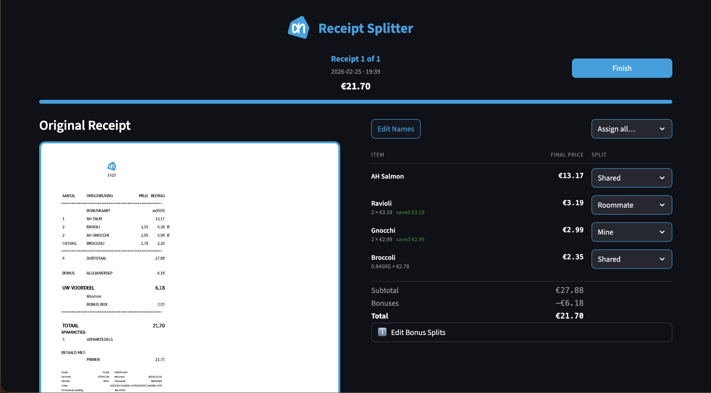
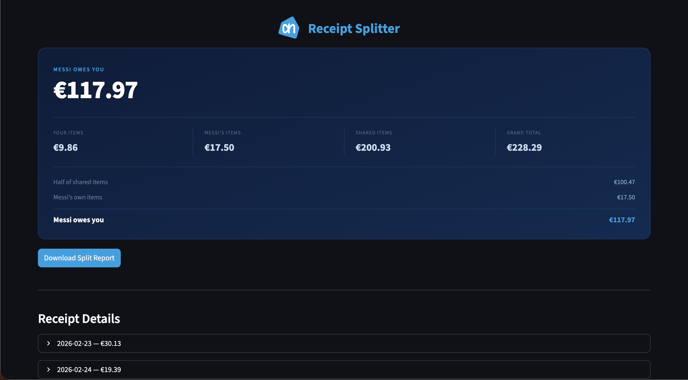
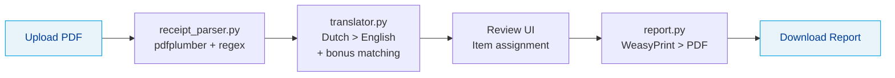

<div align="center">

# AH Receipt Splitter

**Split Albert Heijn grocery receipts between roommates**

[](https://python.org)
[](https://streamlit.io)
[](LICENSE)
[](https://github.com/luclacombe/ah-receipt-splitter/actions)

<br>

Upload PDF receipts from the **Albert Heijn** app, assign each item to yourself or your roommate (or split shared items 50/50), and download a PDF report showing who owes what.

<br>



<br><br>



</div>

---

## Features

| Feature | Description |
|---------|-------------|
| **PDF Parsing** | Extracts items, quantities, prices, and bonus discounts from AH receipt PDFs |
| **Bonus Card Handling** | Automatically distributes bonus savings across discounted items |
| **Bilingual UI** | Dutch and English interface, selectable on launch |
| **Smart Translation** | Dutch item names translated to English via LLM with persistent caching |
| **Intelligent Matching** | Bonus codes matched to items via price, substring, or LLM fallback |
| **PDF Reports** | Generates a print-ready split report with full breakdown |
| **Flexible LLM Backend** | Claude Haiku, GPT-4o-mini, or Ollama (local, free) |

---

## Architecture



### How It Works

1. **Parse** - `pdfplumber` extracts text from the AH receipt PDF. Regex patterns identify item lines (name, qty, unit price, total, bonus flag) and bonus discount lines.

2. **Match Bonuses** - Bonus codes (e.g. `AHBROCCOLILO`) are matched to items via price matching, then substring matching, then LLM fallback. Group bonuses (`ALLE*`) are distributed proportionally.

3. **Translate** - Dutch item names are batch-translated via Claude Haiku, GPT-4o-mini, or Ollama. Results are cached in `translations.json` so each item is only translated once.

4. **Assign** - The Streamlit UI lets you assign each item as **Mine** / **Roommate** / **Shared** with bulk-assign shortcuts.

5. **Report** - WeasyPrint renders a branded HTML template to a PDF with the full cost breakdown.

---

## Quick Start

### Docker (recommended)

```bash
git clone https://github.com/luclacombe/ah-receipt-splitter.git
cd ah-receipt-splitter
cp .env.example .env          # optionally add your ANTHROPIC_API_KEY
docker compose up
```

Open [http://localhost:8501](http://localhost:8501) and upload a receipt.

### Manual Installation

**Prerequisites:** Python 3.11+, system libraries for WeasyPrint

```bash
# macOS
brew install pango cairo libffi

# Ubuntu / Debian
sudo apt-get install -y libpango-1.0-0 libpangocairo-1.0-0 libcairo2 libgdk-pixbuf2.0-0 libffi-dev
```

```bash
git clone https://github.com/luclacombe/ah-receipt-splitter.git
cd ah-receipt-splitter
python -m venv .venv && source .venv/bin/activate
pip install -r requirements.txt
cp .env.example .env          # optionally add your ANTHROPIC_API_KEY
streamlit run app.py
```

### Demo Mode

A sample receipt is included for testing.

```bash
# Upload fixtures/sample_receipt.pdf in the app to try the full flow
```

---

## Configuration

| Variable | Required | Default | Description |
|----------|----------|---------|-------------|
| `ANTHROPIC_API_KEY` | No | - | Claude Haiku API key for item translation |
| `OPENAI_API_KEY` | No | - | GPT-4o-mini API key (used if no Anthropic key) |

Set **one** of these keys — Anthropic is checked first, then OpenAI. **No API key?** The app falls back to [Ollama](https://ollama.com) running locally with `llama3.2:3b`. Install Ollama, pull the model (`ollama pull llama3.2:3b`), and leave both keys unset.

**In Dutch mode** no translation is needed, so the app skips LLM calls entirely.

---

## Development

```bash
pip install -r requirements-dev.txt
make dev        # install deps + pre-commit hooks
make run        # streamlit run app.py
make test       # pytest
make lint       # ruff check + format check
make clean      # remove caches
```

See [CONTRIBUTING.md](CONTRIBUTING.md) for the full guide.

---

## Tech Stack

| Layer | Technology |
|-------|-----------|
| **Frontend** | [Streamlit](https://streamlit.io) |
| **PDF Parsing** | [pdfplumber](https://github.com/jsvine/pdfplumber) |
| **Translation** | [Claude Haiku](https://docs.anthropic.com), [GPT-4o-mini](https://platform.openai.com), or [Ollama](https://ollama.com) |
| **PDF Generation** | [WeasyPrint](https://weasyprint.org) |
| **Language** | Python 3.11+ |

---

## Project Structure

```
ah-receipt-splitter/
├── app.py                    # Entry point (page config + step routing)
├── config.py                 # Constants, paths, model names
├── i18n.py                   # Bilingual UI + report strings
├── theme.py                  # AH brand CSS + header
├── state.py                  # Session state management
├── receipt_parser.py         # PDF > structured data
├── translator.py             # LLM translation + bonus matching
├── report.py                 # HTML > PDF report
├── components/
│   ├── language.py           # Language selection screen
│   ├── upload.py             # File upload + parsing
│   ├── review.py             # Item assignment UI
│   └── summary.py            # Summary + PDF download
├── tests/                    # Unit tests
├── fixtures/                 # Sample receipt for testing
├── Dockerfile                # Container setup
└── docker-compose.yml        # One-command deployment
```

---

## License

[MIT](LICENSE)
